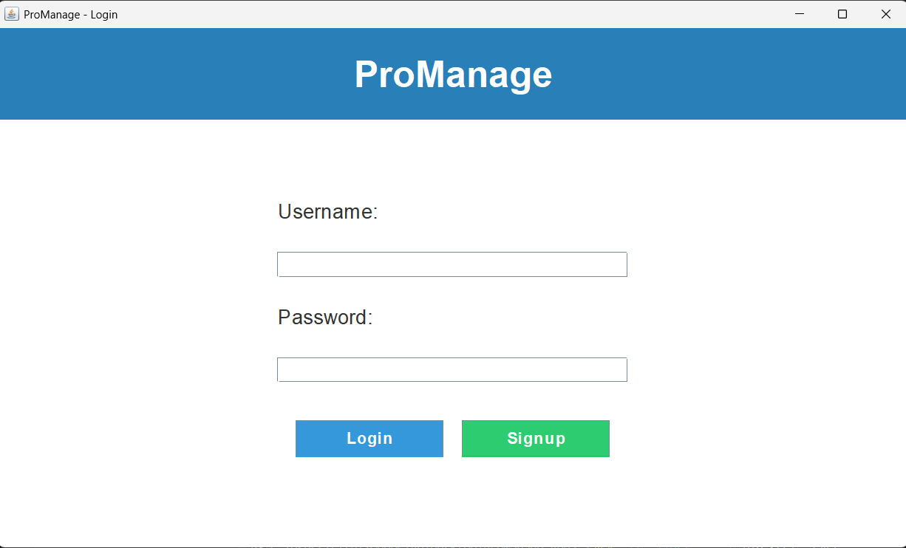
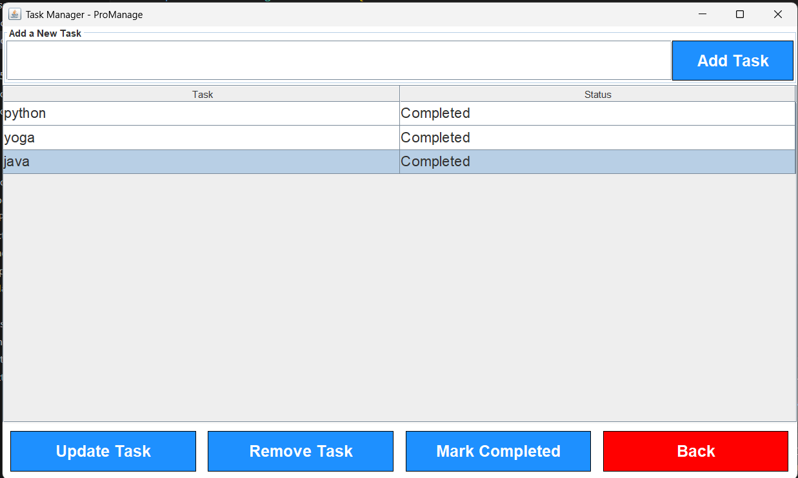
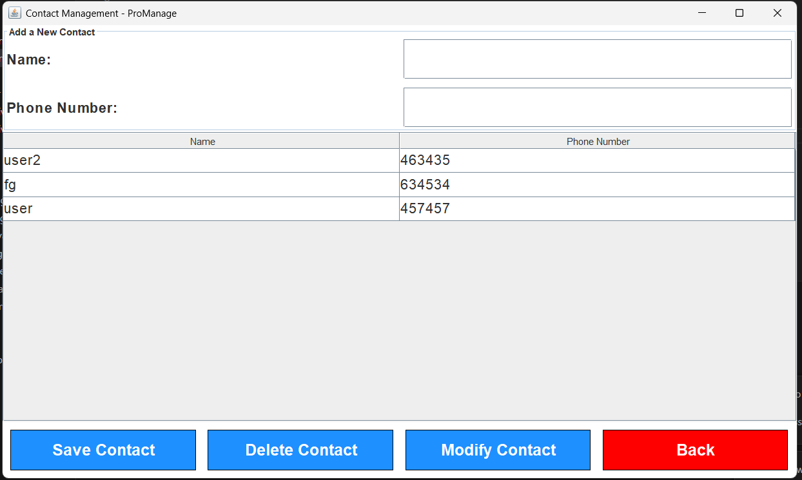

# ProManage

## Description
ProManage is a **Java Swing-based** Software Project Management application with a **MongoDB** backend. It provides a **user-friendly interface** for managing tasks, contacts, and reminders, ensuring **efficient project tracking and organization**.

## Features
- **User Authentication**: Signup and Login with MongoDB storage.
- **Task Management**: Add, delete, and update tasks in a structured to-do list.
- **Contact Management**: Store and manage contacts with names and phone numbers.
- **Reminder System**: Set and manage event reminders with a calendar interface.
- **Full-Screen UI**: A professional and responsive design for better usability.
## 📸 Preview

### login page


### Dashboard Page


### Task Manager


### Contact Page


### Reminder Page

## Tech Stack
- **Java Swing**: GUI development
- **MongoDB**: NoSQL database for data storage
- **Maven**: Dependency management
- **JDBC (MongoDB Driver)**: Database connectivity
- **VS Code / IntelliJ IDEA**: Development environment

## Installation
1. **Clone the Repository**
   ```sh
   git clone https://github.com/Lithika04/ProManage.git
   cd ProManage
